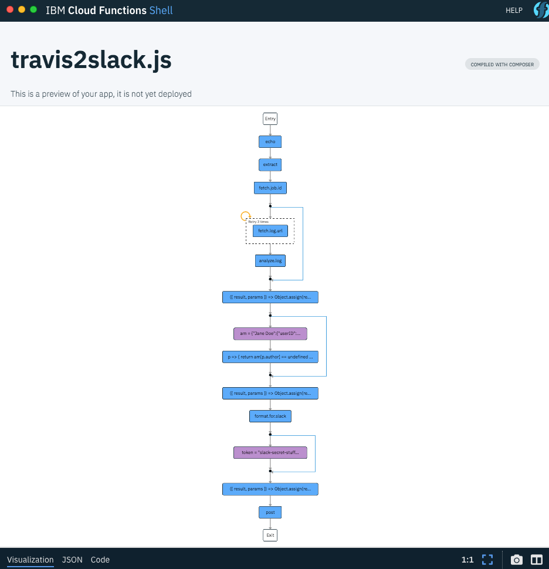
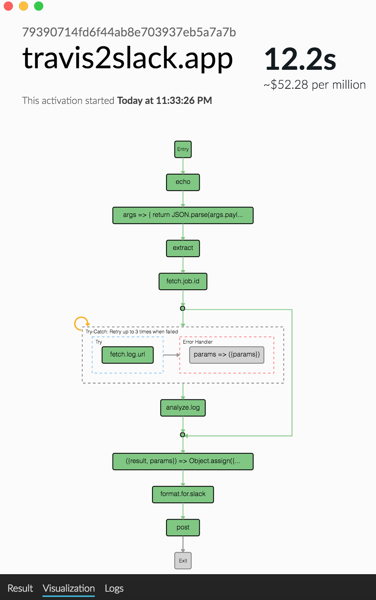

# Setup and testing

You need a Slack token, `wsk` and `fsh` installed.

  1. `export SLACK_TOKEN="..."`
  2. Make sure your name and Slack handle is in `author-map.json`.
  2. `./do.sh --deploy`
  3. `./do.sh --test`   # make sure you're the author of the mock PR (use your "name", not Slack handle as in `author-map.json`).
  4. Confirm you received the Slack notification.
  5. `./do.sh --teardown` to delete all the artifacts.

Create a webhook for Travis CI against a repo. This describes the Apache Openwhisk hook.
It is pointing to:
```hthml
https://openwhisk/api/v1/web/guest/default/travis2slack.receive.webhook.json
```

Run the following and store in the .travis.yml file for the repo.
```bash
$ \travis encrypt --org -r openwhisk/openwhisk "https://openwhisk/api/v1/web/guest/default/travis2slack.receive.webhook.json"
```
To test via curl:
```bash
curl -k https://openwhisk/api/v1/web/guest/default/travis2slack.receive.webhook.json -X POST -H "Content-Type: application/json" -d @sample-formdata.json
```

Here is the app state machine and an example session.



